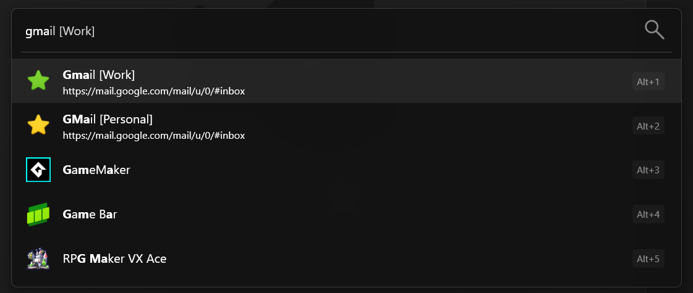

[](https://github.com/sergebat/Flow.Launcher.Plugin.MultiprofileBookmarks/actions/workflows/build.yml)
[](https://github.com/sergebat/Flow.Launcher.Plugin.MultiprofileBookmarks/actions/workflows/test.yml)
[](https://github.com/sergebat/Flow.Launcher.Plugin.MultiprofileBookmarks/actions/workflows/release.yml)

Multi-Profile Bookmark Plugin for Flow Launcher
==================

This C# [Flow launcher](https://github.com/Flow-Launcher/Flow.Launcher) plugin indexes your bookmarks from **multiple browser profiles** and opens them in the correct browser window, so you can keep work and personal browsing separate. 



### Usage

Default action is `bb` to avoid conflict with built-in Bookmarks plugin. 

Change it to `*` to to have all your bookmarks in the global list as on the screenshot above.

### Known limitations

- ❗Chrome only.
- No icon customization per profile. The plugin just cycles a few predefined profile icons in the order of profile discovery. 
- No profile prioritization.
- Does not support bookmark ICO file.

The official built-in bookmarks plugin is definitely more robust and feature complete https://www.flowlauncher.com/plugins/browser-bookmarks/. 

I use this daily on my Windows 11. However please treat this as a prototype for now. PRs, feature requests and bug reports are welcome. 

### Development

```
# This project is built against .NET SDK 9
winget install Microsoft.DotNet.SDK.9

# To build locally and add to your Flow Launcher
./debug.ps1 

# To run test
dotnet test
```

### Release process

1. Update `Flow.Launcher.Plugin.MultiprofileBookmarks/plugin.json` `Version`.
2. Create and push a matching tag in the format `vX.Y.Z` (example: `v0.0.2`).
3. Packaging is done by `release.ps1` (used both locally and in GitHub Actions) to keep outputs in sync.
4. GitHub Actions `Release` workflow attaches `MultiprofileBookmarks.zip` to a GitHub Release.


### Credits

This plugin is heavily based on the official built-in https://www.flowlauncher.com/plugins/browser-bookmarks/. 

### License 

MIT

